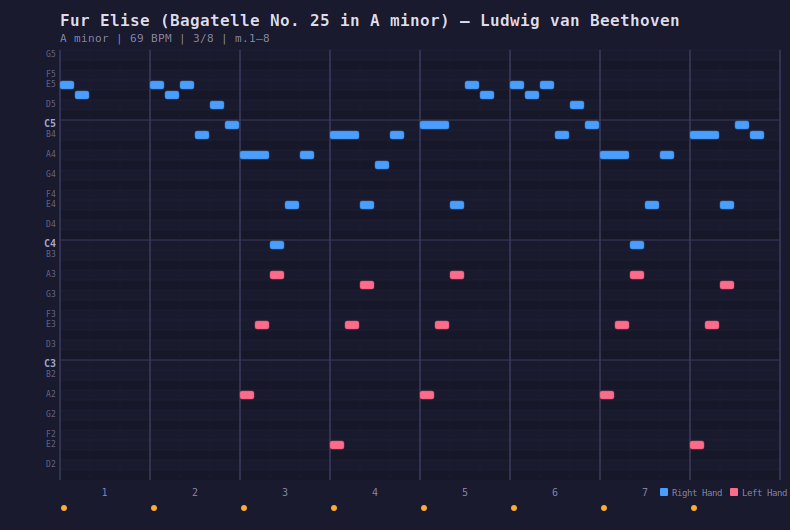

<p align="center">
  <a href="README.md">English</a> | <strong>日本語</strong> | <a href="README.zh.md">中文</a> | <a href="README.es.md">Español</a> | <a href="README.fr.md">Français</a> | <a href="README.hi.md">हिन्दी</a> | <a href="README.it.md">Italiano</a> | <a href="README.pt-BR.md">Português</a>
</p>

<p align="center">
  
</p>

<h1 align="center">AI Jam Session</h1>

<p align="center">
  <em>昔ながらの方法で機械学習</em>
</p>

<p align="center">
  AIにピアノを教えるMCPサーバー。<br/>
  120曲。12ジャンル。本物のMIDI。すべてを記憶する練習日記。
</p>

[](https://github.com/mcp-tool-shop-org/ai-jam-sessions)
[](https://github.com/mcp-tool-shop-org/ai-jam-sessions)

---

## これは何？

AIが弾き方を学ぶピアノ。シンセサイザーでもMIDIライブラリでもなく、教育楽器です。

LLMはテキストを読み、テキストを書けます。しかし私たちのように音楽を体験することはできません——耳も目も筋肉の記憶もありません。AI Jam Sessionはモデルが実際に使える感覚を与えることでそのギャップを埋めます：

- **読む** -- 手書きの近似ではなく、教育アノテーション付きの本物のMIDI楽譜
- **聴く** -- スピーカーで演奏するピアノエンジン。部屋にいる人間がAIの耳になります
- **見る** -- 演奏内容をSVGとしてレンダリングするピアノロール。モデルが読み返して検証できます
- **記憶する** -- セッションをまたいで保持される練習日記。学習が蓄積されます

各ジャンルに1曲のアノテーション済み模範曲があります。AIが残りに取り組む前に学習する参考作品です。残りの96曲は未加工のMIDIで、AIがパターンを学び、音楽を演奏し、自分でアノテーションを書くのを待っています。各セッションは前回の続きから始まります。

## ピアノロール

AIが音楽を見る方法です。ピアノロールはどの曲もSVGとしてレンダリングします——右手は青、左手は珊瑚色、拍子グリッド、強弱記号、小節境界付き：

<p align="center">
  
</p>

<p align="center"><em>エリーゼのために、1-8小節 -- 青いE5-D#5のトリル、珊瑚色の低音伴奏</em></p>

一般的なピアノロールは人間のプロデューサー向けの再生アニメーションです。これはAI向けに作られています。SVG形式なのでモデルは画像として*見る*ことも、ソースマークアップを*読んで*ピッチの正確さ、手の独立性、リズムを検証することもできます。視覚化ではなく、フィードバックループです。

## 学習ループ

```
 読む                演奏              確認              振り返り
┌──────────┐     ┌───────────┐     ┌────────────┐     ┌──────────────┐
│ 模範曲の  │     │ 任意の速度 │     │ ピアノロール│     │ 学んだことを │
│ 分析を    │ ──▶ │ で曲を演奏 │ ──▶ │ で検証     │ ──▶ │ 日記に記録   │
│ 学ぶ      │     │           │     │            │     │              │
└──────────┘     └───────────┘     └────────────┘     └──────┬───────┘
                                                             │
                                                             ▼
                                                    ┌──────────────┐
                                                    │ 次のセッション│
                                                    │ はここから再開│
                                                    └──────────────┘
```

## 曲ライブラリ

12ジャンル120曲、本物のMIDIファイルから構築。各ジャンルに1曲の完全アノテーション済み模範曲があり、AIが残りに取り組む前に学習します。

| ジャンル | 曲数 | 模範曲 |
|---------|------|--------|
| クラシック | 10曲準備完了 | エリーゼのために、月の光、月光ソナタ... |
| R&B | 4曲準備完了 | Superstition (スティーヴィー・ワンダー) |
| ジャズ | 1曲準備完了 | 枯葉 |
| ブルース | 1曲準備完了 | The Thrill Is Gone (B.B.キング) |
| ポップ | 1曲準備完了 | Imagine (ジョン・レノン) |
| ロック | 1曲準備完了 | Your Song (エルトン・ジョン) |
| ソウル | 1曲準備完了 | Lean on Me (ビル・ウィザース) |
| ラテン | 1曲準備完了 | イパネマの娘 |
| 映画音楽 | 1曲準備完了 | Comptine d'un autre ete (ヤン・ティルセン) |
| ラグタイム | 1曲準備完了 | ジ・エンターテイナー (スコット・ジョプリン) |
| ニューエイジ | 1曲準備完了 | River Flows in You (イルマ) |
| フォーク | 1曲準備完了 | グリーンスリーヴス |

曲は**raw**（MIDIのみ）から**ready**（完全アノテーション済みで演奏可能）へ進みます。AIは`annotate_song`でアノテーションを書いて曲を昇格させます。

## 練習日記

日記はAIの記憶です。曲を演奏した後、サーバーは何が起きたかを記録します。どの曲を、どの速度で、何小節、どのくらいの時間。AIは自分の振り返りを追加します：気づいたパターン、認識したこと、次に試すこと。

```markdown
---
### 14:32 — 枯葉
**jazz** | intermediate | G minor | 69 BPM x 0.7x | 32/32 measures | 45s

5-8小節のii-V-I（Cm7-F7-BbMaj7）はThe Thrill Is GoneのV-iと同じ
引力を持っている。ただしメジャーで。ブルースとジャズはジャンルの
ラベルが示す以上に共通点がある。

次回：フルスピードで試す。イパネマのブリッジの転調と比較する。
---
```

1日1つのマークダウンファイル、`~/.pianoai/journal/`に保存。人間が読め、追記のみ。次のセッションでAIは日記を読んで前回の続きから始めます。

## インストール

```bash
npm install -g @mcptoolshop/ai-jam-sessions
```

**Node.js 18+**が必要です。MIDIドライバー、仮想ポート、外部ソフトウェアは不要。

### Claude Desktop / Claude Code

```json
{
  "mcpServers": {
    "ai_jam_sessions": {
      "command": "npx",
      "args": ["-y", "-p", "@mcptoolshop/ai-jam-sessions", "ai-jam-sessions-mcp"]
    }
  }
}
```

## MCPツール

### 学ぶ

| ツール | 機能 |
|--------|------|
| `list_songs` | ジャンル、難易度、キーワードで検索 |
| `song_info` | 音楽分析、教育目標、スタイルのヒント |
| `library_progress` | 全ジャンルのアノテーション状況 |
| `list_measures` | 全小節のノートと教育ノート |
| `teaching_note` | 1小節の詳細分析 |

### 演奏する

| ツール | 機能 |
|--------|------|
| `play_song` | スピーカーで演奏（速度、モード、小節範囲） |
| `stop_playback` | 現在の曲を停止 |
| `pause_playback` | 一時停止・再開 |
| `set_speed` | 演奏中の速度変更 |
| `view_piano_roll` | 曲をSVGピアノロールとしてレンダリング |

### 記憶する

| ツール | 機能 |
|--------|------|
| `save_practice_note` | 日記エントリを書く（セッションデータは自動取得） |
| `read_practice_journal` | 最近のエントリを読み込む |
| `annotate_song` | 未加工の曲を準備完了に昇格（AIの宿題） |

## CLI

```
pianoai list [--genre <genre>] [--difficulty <level>]
pianoai play <song-id> [--speed <mult>] [--mode <mode>]
pianoai view <song-id> [--measures <start-end>] [--out <file.svg>]
pianoai info <song-id>
pianoai library
```

## ステータス

v0.1.0。12ジャンル120のMIDIファイル。24曲が完全アノテーション済みで演奏可能（各ジャンル1曲の模範曲 + クラシック10曲 + R&B 4曲）。セッションをまたいだ永続的学習のための練習日記。6つのキーボード音色（グランド、アップライト、エレクトリック、ホンキートンク、ミュージックボックス、ブライト）。MIDIはすべて揃っています。AIが学ぶにつれてライブラリは成長します。

## ライセンス

MIT
